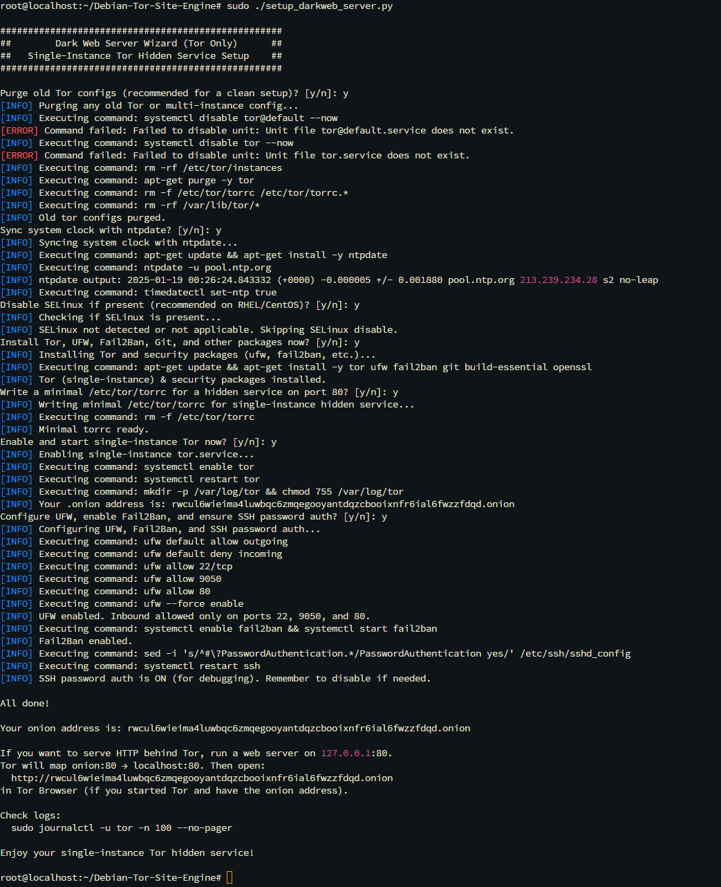
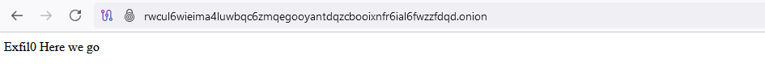

# Debian Tor Site Engine

A comprehensive wizard-style tool to install and configure a **single-instance Tor hidden service** on Debian/Ubuntu systems. It also sets up basic security (UFW, Fail2Ban), synchronizes the system clock, and optionally disables SELinux if present.

> **Disclaimer:**  
> This script is intended for legitimate uses only. Operating hidden services or servers may be restricted or illegal in your jurisdiction. Always follow your local laws, and use Tor responsibly.

---

## Description

The **Dark Web Server Wizard** (`setup_darkweb_server.py`) is an automated script that:

1. **Purges old Tor configurations** to avoid conflicts with multi-instance setups.  
2. **Installs single-instance Tor** alongside security packages (`ufw`, `fail2ban`, `git`, `build-essential`, `openssl`).  
3. **Sets up a minimal Tor configuration** (`/etc/tor/torrc`) that maps an `.onion` address to local port 80.  
4. **Enables UFW** firewall rules (allowing inbound on ports `22`, `9050`, and `80` only).  
5. **Enables Fail2Ban** to mitigate brute-force attacks.  
6. **Optionally disables SELinux**, if detected.  
7. **Synchronizes the system clock** with `ntpdate` (important for Tor’s correct operation).
8. **Addon Flask Deployment**: Includes an optional addon to deploy a minimal Flask landing page.

This script interacts with you via yes/no prompts, making it easy to skip or include specific steps.



---

## Features

- **Wizard-Style Prompts**: Step-by-step approach, giving you full control over each operation.  
- **Fresh Tor Setup**: Ensures no leftover multi-instance configs.  
- **Security Tools**: Quickly hardens your server with UFW and Fail2Ban.  
- **Time Sync**: Avoids Tor clock-related issues by installing and running `ntpdate`.  
- **SELinux Handling**: Gracefully disables SELinux if present; otherwise, it’s skipped.  
- **SSH Convenience**: Optionally keeps SSH password authentication enabled for debugging (which you can disable later).  
- **Flask Deployment**: Provides a simple Flask-based landing page as an optional addon.

---

## Installation

1. **Clone or Download the Script**

   ```bash
   # Option 1: Using git
   git clone https://github.com/exfil0/Debian-Tor-Site-Engine.git
   cd Debian-Tor-Site-Engine
   ```

2. **Make Scripts Executable**

   ```bash
   chmod +x setup_darkweb_server.py site-deployment/flask.py
   ```

3. **Run the Main Wizard as Root**

   ```bash
   sudo ./setup_darkweb_server.py
   ```

   You will be prompted with yes/no questions for each major step.

4. **(Optional) Deploy the Flask Addon**

   ```bash
   sudo ./site-deployment/flask.py
   ```

   - Installs Flask if not already present.
   - Deploys a simple landing page showing "Exfil0 Here we go."
   - (Optional) Sets up a systemd service to keep the Flask app running.



5. **Note**: On some systems, you may need to install Python 3 if it isn’t already present:

   ```bash
   sudo apt-get update && sudo apt-get install -y python3
   ```

---

## Usage

### Follow the Prompts

- **Purge Old Tor?** Recommended unless you have a specific reason to keep existing Tor configs.  
- **Sync Time?** Highly recommended to ensure Tor works properly.  
- **Disable SELinux?** Mostly relevant if you’re on RedHat/CentOS-based systems with SELinux enforced.  
- **Install Tor & Security Packages?** Installs single-instance Tor, UFW, Fail2Ban, Git, Build-Essential, and OpenSSL.  
- **Write Minimal torrc?** Creates a configuration that listens on 127.0.0.1:80 and publishes it as a hidden service on an autogenerated .onion address.  
- **Enable & Start Tor?** Waits up to 60 seconds for Tor to produce a hostname file in `/var/lib/tor/hidden_service`.  
- **Configure Security (UFW, Fail2Ban, SSH)?** Sets up a strict firewall, enables Fail2Ban, and keeps SSH password auth enabled for easy debugging.

### Host Your Web Service

Once the script completes, you’ll have an `.onion` address printed to your screen. To serve content:

- Run any web server on `127.0.0.1:80`.
- Access your hidden service from Tor Browser at `http://YOUR_ONION_ADDRESS.onion`.

### Deploy Flask Landing Page (Optional)

- Run the Flask addon script to set up a minimal web service with a default landing page.
- Access the `.onion` address via Tor Browser to view the deployed page.

### Check Logs

```bash
sudo journalctl -u tor -n 100 --no-pager
```

This shows the latest Tor logs. Adjust `-n` to view more lines.

---

## Roadmap

### Flask Integration

Improve the sample app with templating, user authentication, etc.

### Crawlers

Integrate optional crawler scripts to index and monitor your hidden service, or to crawl external onion links for research purposes.

### Monitors

Add monitoring tools (like `monit` or custom watchers) to keep track of Tor’s health, hidden service availability, and server performance.

---

## Contributing

1. Fork the repository and create your branch:

   ```bash
   git checkout -b feature/your-feature
   ```

2. Commit your changes:

   ```bash
   git commit -am 'Add new feature'
   ```

3. Push to the branch:

   ```bash
   git push origin feature/your-feature
   ```

4. Create a new Pull Request in GitHub.

---

## License

This project is open-source and available under the MIT License. Feel free to fork and adapt it to your needs.
